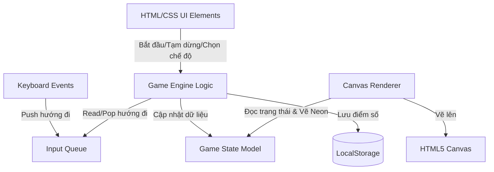

# Architecture Spine — Neon Snake Game

## Design Paradigm

Trò chơi áp dụng mẫu thiết kế **Vòng lặp trò chơi đơn luồng (Single-Threaded Game Loop Pattern)** kết hợp tách biệt dữ liệu trạng thái (**State Model**) và logic hiển thị (**View Renderer**):

*   **State Model (Trạng thái)**: Đối tượng lưu trữ toàn bộ dữ liệu hiện tại của trò chơi (vị trí rắn, vị trí mồi, hướng di chuyển, danh sách chướng ngại vật, điểm số).
*   **Game Loop (Vòng lặp)**: Một hàm chạy định kỳ (sử dụng `setInterval` hoặc `requestAnimationFrame` kết hợp quản lý delta time) có nhiệm vụ cập nhật State Model dựa trên thời gian và hướng di chuyển hiện tại.
*   **View Renderer (Hiển thị)**: Xóa canvas và vẽ lại toàn bộ trạng thái mới từ State Model lên HTML5 Canvas trên mỗi game tick, kèm theo hiệu ứng neon và hạt sáng (particle).

## Invariants & Rules

### AD-1 — Công nghệ Core tối giản (No-Framework Web Stack)

*   **Binds:** all
*   **Prevents:** Sự phụ thuộc không cần thiết vào các thư viện bên ngoài (như React, Vue, Webpack, Vite) làm phình to mã nguồn và tăng thời gian tải trang.
*   **Rule:** Trò chơi phải được xây dựng hoàn toàn bằng HTML5, Vanilla CSS và Vanilla JavaScript chạy trực tiếp trên trình duyệt, không cần qua bước đóng gói (no build step).

### AD-2 — Quản lý hướng đi thông qua hàng đợi (Input Queue Buffer)

*   **Binds:** FR-3
*   **Prevents:** Hiện tượng lặp phím quá nhanh trong một khung hình (tick) làm rắn tự quay đầu cắn chính mình (ví dụ: đang đi Phải, ấn nhanh Lên rồi Trái trước khi game tick cập nhật).
*   **Rule:** Hướng di chuyển từ phím bấm không được ghi đè trực tiếp lên trạng thái rắn ngay lập tức. Phím bấm hợp lệ phải được đẩy vào một mảng hàng đợi `inputQueue`. Mỗi game tick di chuyển chỉ lấy ra (pop) hướng đi đầu tiên của hàng đợi để xử lý. Hướng đi ngược với hướng hiện tại sẽ bị loại bỏ ngay lập tức.

### AD-3 — Bàn chơi dạng lưới độc lập và Xuyên tường (Grid Wrap-Around)

*   **Binds:** FR-4, FR-7
*   **Prevents:** Sự không nhất quán về kích thước lưới giữa logic game và giao diện hiển thị.
*   **Rule:** Logic game hoạt động hoàn toàn trên hệ tọa độ nguyên 20x20 ô (từ 0 đến 19). Cơ chế xuyên tường (wrap-around) được tính toán bằng phép toán chia lấy dư (modulo) để tự động đưa rắn về đầu lưới bên kia khi vượt biên: `newCoord = (coord + gridSize) % gridSize`.

### AD-4 — Lưu trữ High Score cục bộ (Local Storage Persistence)

*   **Binds:** FR-10
*   **Prevents:** Ghi đè hoặc nhầm lẫn dữ liệu điểm số cao giữa chế độ Classic và Challenge.
*   **Rule:** Điểm cao nhất được lưu riêng biệt dưới dạng số nguyên vào LocalStorage của trình duyệt với hai khóa cố định: `neon_snake_classic_high` và `neon_snake_challenge_high`. Việc so sánh và ghi đè điểm cao mới chỉ thực hiện ngay tại thời điểm Game Over.



## Consistency Conventions

| Concern | Convention |
| --- | --- |
| Naming (CSS class / JS) | CSS sử dụng kebab-case (ví dụ: `.game-container`, `.menu-title`). Biến và hàm trong JS sử dụng camelCase (ví dụ: `updateGame`, `drawSnake`). Hằng số sử dụng UPPERCASE (ví dụ: `GRID_SIZE = 20`). |
| Data & formats | Tọa độ trên lưới được lưu dưới dạng đối tượng có thuộc tính `{x, y}` (với `0 <= x, y < 20`). Mảng rắn `snake` lưu danh sách các tọa độ từ đầu (index 0) tới đuôi. |
| State Management | Trạng thái game (`gameStatus`) chỉ có 4 giá trị chuỗi: `'MENU'`, `'PLAYING'`, `'PAUSED'`, `'GAME_OVER'`. Thay đổi trạng thái phải đi kèm với việc cập nhật giao diện UI tương ứng. |

## Stack

| Name | Version |
| --- | --- |
| HTML5 | Standard |
| CSS3 | Standard |
| Vanilla JavaScript (ES6+) | Standard |

## Structural Seed

Cấu trúc thư mục tối giản của dự án:

```text
{root}/
  index.html        # Điểm vào ứng dụng, chứa cấu trúc UI và thẻ canvas
  style.css         # CSS định dạng giao diện Neon Dark Mode và hiệu ứng chuyển đổi màu
  game.js           # Logic game loop, trạng thái và canvas renderer
```

## Capability → Architecture Map

| Capability / Area | Lives in | Governed by |
| --- | --- | --- |
| FR-1, FR-2: Chế độ chơi & Menu | index.html, game.js | AD-1 (No framework), State Conventions |
| FR-3, FR-4: Di chuyển & Xuyên tường | game.js | AD-2 (Input Queue), AD-3 (Grid Modulo) |
| FR-6, FR-7: Mồi & Vật cản | game.js | AD-3 (Grid logic) |
| FR-8, FR-9: Đổi màu Neon & Hạt bụi sáng | style.css, game.js | Render Pattern, Design.md (Neon) |
| FR-10: Lưu trữ High Score | game.js | AD-4 (LocalStorage) |

## Deferred

*   **Hệ thống âm thanh (Audio)**: Thiết kế âm thanh 8-bit hoặc nhạc nền retro được đẩy xuống giai đoạn mở rộng tính năng (v2), vì không ảnh hưởng đến độ nhất quán kỹ thuật cốt lõi của game ở v1.
