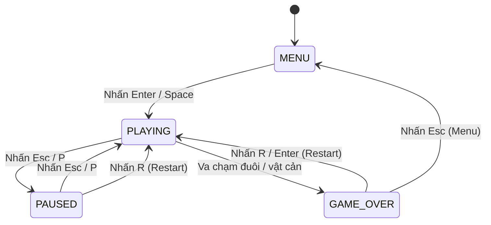

# EXPERIENCE.md - Neon Snake Game

Tài liệu này xác định cách thức hoạt động, sơ đồ trạng thái, cấu trúc màn hình và trải nghiệm tương tác của game Rắn Săn Mồi Neon.

## 1. Foundation
*   **Hệ thống hiển thị**: Single Page Application chạy trực tiếp trên trình duyệt.
*   **Vùng vẽ (Canvas)**: HTML5 `<canvas>` kích thước 400x400px.
*   **Đầu vào (Input)**: Bàn phím máy tính thông qua sự kiện lắng nghe Keydown.
*   **Lưu trữ**: Web LocalStorage lưu điểm cao cục bộ.

## 2. Information Architecture (Màn hình & Trạng thái)

Game được chia thành các màn hình (Screen) hiển thị đè lên nhau tùy thuộc vào trạng thái hiện tại:

### 2.1 Màn hình Menu chính (Menu Screen)
*   **Tiêu đề**: Chữ "NEON SNAKE" phát sáng lớn ở trên cùng.
*   **Lựa chọn chế độ**:
    *   `[ ] CLASSIC MODE` - Bản đồ trống.
    *   `[ ] CHALLENGE MODE` - Bản đồ có 5 chật cản.
*   **Bảng điểm cao**:
    *   Classic High: {score} | Challenge High: {score}
*   **Hướng dẫn nhanh**: "USE ARROWS/WASD TO SELECT, ENTER TO PLAY".

### 2.2 Màn hình Chơi game (Game Screen)
*   **Thanh đầu trang (Header)**:
    *   Hiển thị Score hiện tại (căn trái).
    *   Hiển thị High Score của chế độ hiện tại (căn phải).
*   **Khu vực chính**: HTML5 Canvas hiển thị rắn di chuyển, mồi và vật cản (nếu có).
*   **Hướng dẫn ở chân trang**: "PRESS ESC OR P TO PAUSE".

### 2.3 Màn hình Tạm dừng (Pause Overlay)
*   Một lớp phủ (overlay) bán trong suốt màu đen đè lên canvas game.
*   Hiển thị chữ "PAUSED" nhấp nháy màu neon chủ đạo ở chính giữa.
*   Hướng dẫn: "PRESS ESC TO RESUME, R TO RESTART".

### 2.4 Màn hình Kết thúc game (Game Over Overlay)
*   Một lớp phủ bán trong suốt màu đen đè lên canvas.
*   Hiển thị chữ "GAME OVER" màu đỏ/neon chủ đạo ở chính giữa.
*   Hiển thị số điểm đạt được và thông báo "NEW HIGH SCORE" nhấp nháy nếu phá kỷ lục.
*   Hai nút lựa chọn:
    *   `PLAY AGAIN` (Nhấn `R` hoặc `Enter`)
    *   `MAIN MENU` (Nhấn `Esc`)

## 3. Voice and Tone (Ngôn ngữ)
*   **Phong cách**: Retro Arcade, ngắn gọn, viết hoa toàn bộ (Uppercase) cho các thông báo hệ thống chính để gợi lại ký ức điện tử thùng.
*   **Các thông báo chính**:
    *   `NEON SNAKE` (Menu chính)
    *   `GAME OVER` (Thất bại)
    *   `NEW HIGH SCORE!` (Kỷ lục mới)
    *   `PAUSED` (Tạm dừng)

## 4. State Patterns (Sơ đồ trạng thái)

Trò chơi tuân theo máy trạng thái (State Machine) sau:

## 5. Component Patterns & Game Loop Logic

### 5.1 Game Loop
*   Trò chơi chạy trên một chu kỳ cập nhật (tick) cách nhau một khoảng thời gian `speed`.
*   Tốc độ khởi đầu `speed = 150ms`.
*   Mỗi khi Rắn ăn Mồi, `speed = Math.max(50, speed - 5)`.

### 5.2 Cơ chế di chuyển & Hàng đợi phím bấm
*   Để ngăn ngừa lỗi nhấn hai phím cực nhanh khiến rắn tự cắn đuôi (ví dụ: đang đi Phải, ấn Lên rồi Trái trước khi game tick mới chạy), hướng đi mới được lưu vào một hàng đợi nhập liệu (`inputQueue`).
*   Trong mỗi game tick, chỉ phần tử đầu tiên của `inputQueue` được lấy ra để cập nhật hướng di chuyển của Rắn, đảm bảo không thể quay ngược hướng 180 độ trong 1 tick.

### 5.3 Cơ chế đi xuyên tường (Wrap Around)
*   Tọa độ lưới chạy từ X: 0 - 19 và Y: 0 - 19.
*   Nếu đầu rắn cập nhật ở vị trí X = 20, tọa độ mới sẽ được đặt là X = 0.
*   Nếu đầu rắn cập nhật ở vị trí X = -1, tọa độ mới sẽ được đặt là X = 19.
*   Tương tự với trục Y.

## 6. Key Flows (Hành trình trải nghiệm chính)

### Flow-1: Khởi đầu và phá điểm kỷ lục
1.  Người chơi mở trang web, hiển thị màn hình chính `MENU`.
2.  Hệ thống tải điểm cao từ `localStorage`: hiển thị "CLASSIC HIGH: 120".
3.  Người chơi dùng phím mũi tên chọn `CLASSIC MODE` và nhấn `Enter`. Trạng thái chuyển sang `PLAYING`.
4.  Rắn bắt đầu chạy. Người chơi ăn mồi liên tiếp. Điểm số tăng lên: 80 -> 90 -> 100.
5.  Ngay khi điểm số đạt 100, toàn bộ màu viền canvas và màu rắn chuyển đổi từ Xanh lá neon sang Hồng neon. Tốc độ di chuyển tăng lên đáng kể.
6.  Điểm số tăng lên 130. Người chơi sơ ý đâm vào đuôi rắn. Game chuyển sang trạng thái `GAME_OVER`.
7.  Hệ thống phát hiện điểm số 130 > 120 (kỷ lục cũ).
8.  Màn hình hiển thị chữ "NEW HIGH SCORE!" nhấp nháy màu vàng neon lấp lánh và phát ra hiệu ứng hạt ăn mồi xung quanh chữ.
9.  Hệ thống tự động lưu `localStorage.setItem('neon_snake_classic_high', 130)`.
10. Người chơi nhấn phím `R` để chơi lại hoặc `Esc` để quay về `MENU`.
